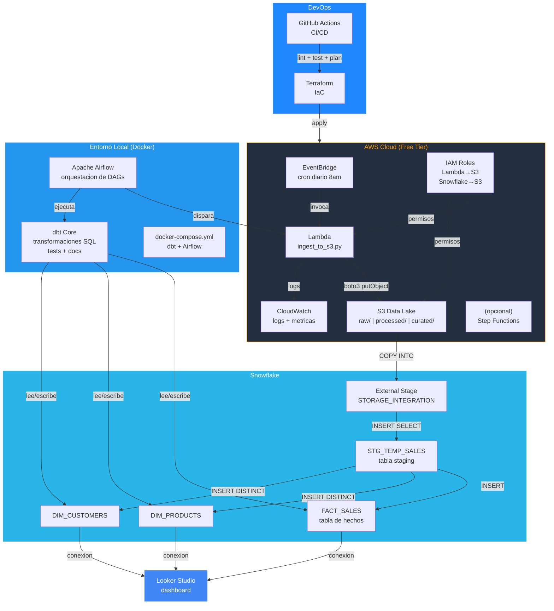
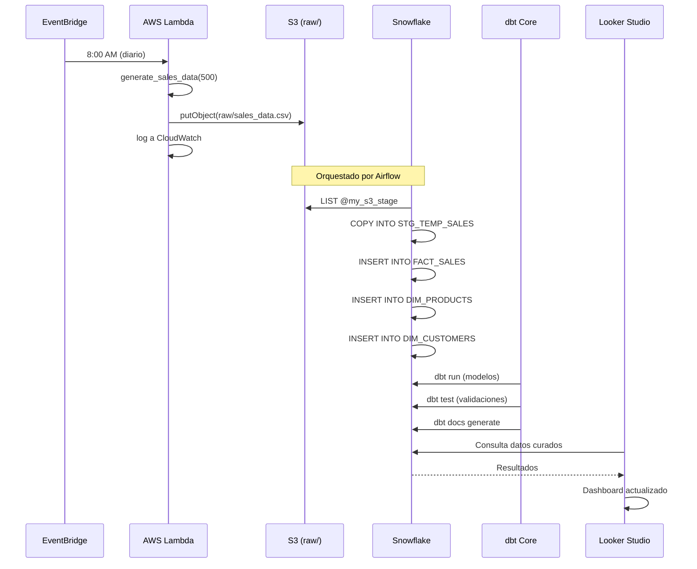
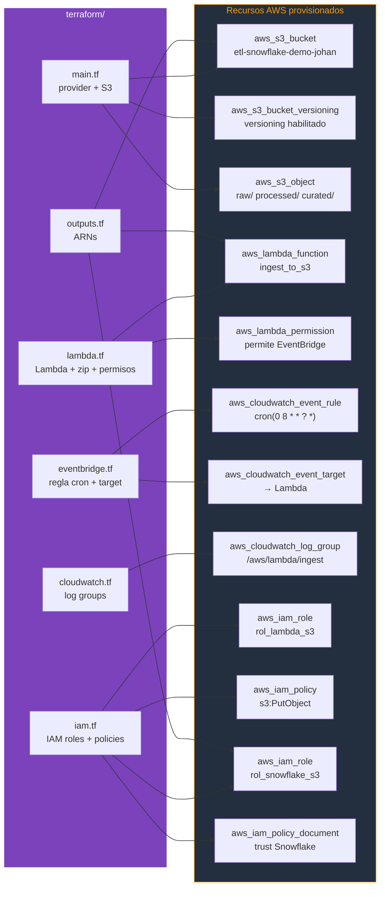

# Diagramas de Arquitectura

> **Formato**: Mermaid (nativo en GitHub). Para exportar a draw.io o Lucidchart: copiar el bloque de codigo y usar `File > Import From > Mermaid` o usar https://mermaid.live.

---

## 1. Arquitectura General del Sistema

---

## 2. Flujo de Datos End-to-End

---

## 3. Infraestructura AWS (Terraform — IaC)

---

## Exportacion a otras herramientas

### draw.io
1. Abrir https://app.diagrams.net
2. `Arrange > Insert > Advanced > Mermaid`
3. Pegar el bloque de codigo Mermaid
4. `Insert` — convierte a diagrama nativo de draw.io

### Lucidchart
1. Abrir Lucidchart
2. `+ New > Import > Mermaid`
3. Pegar el codigo y hacer clic en `Import`

### Mermaid Live (online)
1. Abrir https://mermaid.live
2. Pegar el codigo
3. `Actions > Export as PNG/SVG`
